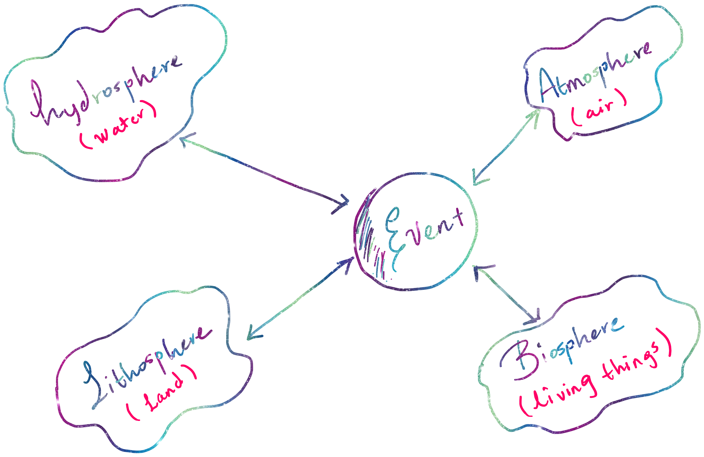
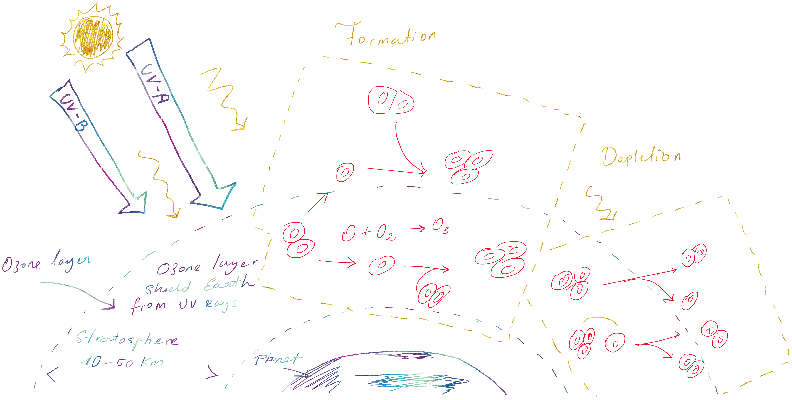

---
jupytext:
  formats: md:myst
  text_representation:
    extension: .md
    format_name: myst
    format_version: 0.13
    jupytext_version: 1.11.5
kernelspec:
    name: "python3"
    display_name: "Python 3"
---

# Earth System Interactions

## Q1. Interaction of the earth spheres

The earth system can be divided into four subsystems: land, water, living things, or air. These systems are called "spheres." The respective names given to each system are "lithosphere" (land), "biosphere" (living things), and "atmosphere" (air). But How do they interact?

The literature identifies many possible types of interaction that could occur within the earth system. Four of these interactions are between the event and each of the earth's spheres ( see [Figure Q1.1.](#FigureQ1.1.)). In the [Figure Q1.1.](#FigureQ1.1.) The double-headed arrows indicate that the cause and effects of these interactions go in both directions {cite}`NOAA_earth_spheres`. These spheres continuously interact, driving critical processes such as climate regulation, nutrient cycling, and the hydrological cycle.

<a name="FigureQ1.1."></a>


The lithosphere, which includes Earth’s crust and upper mantle, holds about 99.9% of the planet’s mass. Its volume also accounts for nearly the entire Earth (~99.9%), providing the foundation for most physical and biological processes. The hydrosphere, composed of all water bodies, makes up only 0.03% of Earth’s mass but plays a crucial role in energy transfer and climate regulation. The atmosphere, with a mass of about 0.0001% of the Earth’s total, governs weather patterns and provides the essential gases for life. Despite its relatively small mass, it occupies a large portion of Earth’s volume due to its extensive vertical reach. The biosphere—although comprising a minuscule fraction of Earth’s mass—interacts with all other spheres, driving carbon and nitrogen cycles essential for life {cite}`Ontario_earth_spheres`.

These spheres are interconnected in complex ways. For instance, volcanic eruptions in the lithosphere release gases into the atmosphere, affecting climate and ecosystems. Similarly, the atmosphere and hydrosphere interact to regulate global temperatures through the water cycle. Human activities also influence these interactions, intensifying changes in climate and ecosystems. Understanding these relationships is vital for predicting and mitigating environmental challenges in the Anthropocene {cite}`NOAA_earth_spheres,Ontario_earth_spheres`.

## Q2. How does ozone interact with UV radiation: physical-chemical reaction behind that interaction

The ozone layer, located in the stratosphere (10–50 km above Earth’s surface), plays a crucial role in protecting life on Earth by absorbing harmful ultraviolet (UV) radiation from the sun. This protective shield is the result of a dynamic process involving the formation and natural depletion of ozone ($O_{3}$) molecules through interactions with UV radiation {cite}`Aguado2015`.

The formation of ozone begins when molecular oxygen $O_{2}$ absorbs high-energy UV-C radiation, causing the molecule to split into two oxygen atoms (O) as shows in [Figure Q2.1.](#FigureQ2.1). The [Figure Q2.1.](#FigureQ2.1) represents the interaction of UV-A and UV-B rays in the ozone layer, the diagram shows tow phases: ozone formation and ozone depletion by UV rays interaction (natural causes).In the formation of the ozone, these free oxygen atoms then react with other $O_{2}$ molecules to form ozone ($O_{2}$). This process can be represented by the reaction {cite}`Aguado2015,ozone_depletion`:

`O + O₂ → O₃`

<a name="FigureQ2.1"></a>


This newly formed ozone absorbs UV-B radiation, splitting back into $O_{2}$ and an oxygen atom. The free oxygen atom can recombine with another O molecule, maintaining a continuous cycle. These interactions filter most UV-B and UV-C rays, preventing them from reaching Earth’s surface, while UV-A radiation passes through largely unaffected. Natural processes contribute to the depletion of ozone. Ozone molecules naturally break down when they absorb UV radiation. The reaction can be summarized as {cite}`Aguado2015,ozone_depletion`:

`O₃ + UV-B → O₂ + O`

This natural cycle of formation and destruction maintains a delicate balance in ozone concentration, ensuring that harmful UV radiation is reduced to safe levels. The ozone layer’s importance lies in its ability to regulate UV exposure, which can cause skin cancer, cataracts, and DNA damage in living organisms. Although this natural balance is typically self-sustaining, it is vulnerable to external influences such as human-made chemicals. Understanding these natural processes is key to protecting this vital shield and guaranteeing its preservation for future generations {cite}`Aguado2015,ozone_depletion,broadhead_ozone`.

## Q3. Ocean gyres

Ocean gyres are large systems of circular currents driven by global wind patterns, Earth's rotation, and the distribution of landmasses. These gyres play a vital role in the Earth’s climate system by redistributing heat, influencing weather patterns, and regulating marine ecosystems. There are five major ocean gyres: the North and South Atlantic, North and South Pacific, and the Indian Ocean gyres {cite}`ocean_gyre,noaa_gyre`.

The first element, winds push the surface of the ocean in certain directions. Trade winds in the tropics push water westward, while westerly winds at higher latitudes push it back east. This creates a circular flow of water. Next to winds acts the Earth’s rotation causing the water to move in a curved path rather than straight. This is called the Coriolis effect. In the Northern Hemisphere, it makes water turn to the right, while in the Southern Hemisphere, it turns left. This twist is what helps create the circular motion of ocean gyres. Finally, continents act like barriers, forcing the water to turn and stay in a loop. Imagine water flowing into a big bowl—when it hits the sides, it turns and keeps spinning around {cite}`wikipedia_ocean_gyre`.

What does it matter? - Ocean gyres are important because they move heat from the equator to colder areas, which helps regulate the Earth’s climate. But, they can also collect floating trash, like plastic, in their centers. This has led to environmental problems such as the Great Pacific Garbage Patch, a massive pile of plastic caught in the **Pacific gyre**. Understanding these effects is another way to mitigate the effects of human activities and the environmental disaster created {cite}`wikipedia_ocean_gyre`.

## Q4. El Niño-southern oscillation (ENSO)

El niño is a natural climate phenomenon that impacts weather and climate patterns. According to the article "Antropogenic impacts on twentieth-centiry ENSO variability changes" {cite}`Cai2023`, **ENSO variability has increased since 1960**, with more frequent and extreme **El Niño** and **La Niña** events, possibly due to human-induced climate change.

ENSO consists of two main phases: El Niño, which brings unusually warm ocean temperatures in the eastern Pacific, and la Niña, which results in cooler ocean temperatures. These phases affect atmospheric circulation, leading to changes in rainfall patterns, droughts, floods, and even tropical cyclone activity in different parts of the world. For instance, **El Niño causes heavy rains and flooding** in the eastern Pacific regions like South America, while la Niña brings droughts to those same areas but causes increased rainfall and flooding in places like Australia and Southeast Asia.

The article highlights that anthropogenic warming, mainly from greenhouse gas emissions has contribute to stronger ENSO events. Climate models show that since 1960, the variability of ENSO has increased by about $10%$. This increase is linked to changes in ocean stratification (the layering of warmer water on top of cooler water), which strengthes the interaction between the ocean and atmosphere. As a result, both stron El Niño and La Niña events are occurring more frequently, amplifying their impacts on global weather systems.

In simple terms, ENSO is like a climate pendulim that swings back and forth between EL Niño and La Niña. Human-induced climate change is pushing this pendulum harder, making it swing more wildly and causing extreme weather to become more common and intense around the world. Understanding and predicting these changes is critical for managing theirs impacts on agriculture, water resources, and disasters.


## References

```{bibliography}
```

